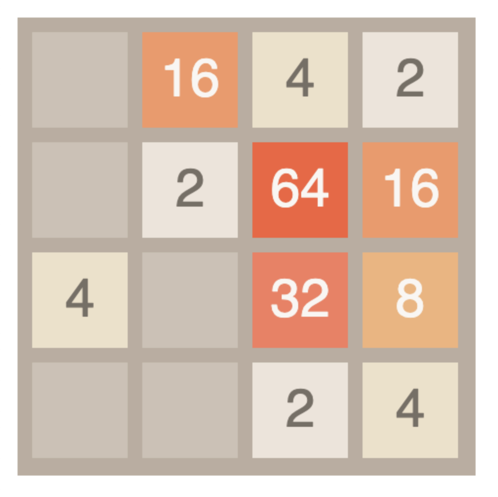

2048 clone written in C to HTML canvas via WASM without Emscripten.

Shamelessly copied from https://play2048.co/.

Inspired by https://surma.dev/things/c-to-webassembly/ and https://github.com/tsoding/snake-c-wasm/.

Built with LLVM and Clang. Served via Python http.server.

```bash
> make        # build the .wasm
> make serve  # serve the html
```


